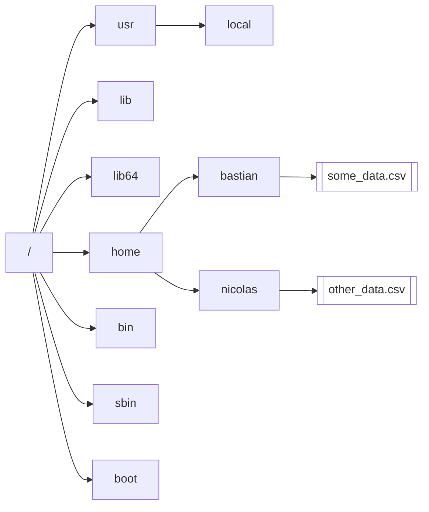
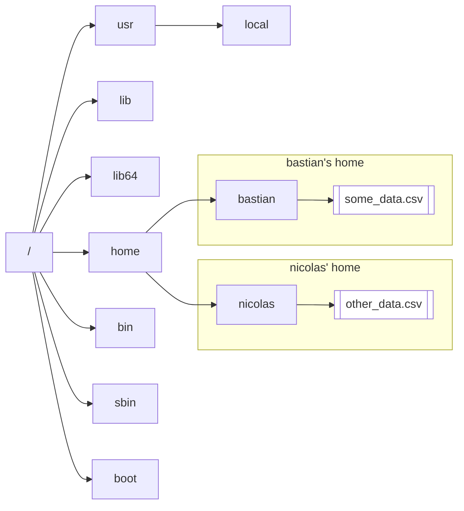

# Linux 101 - 01 Filesystem

## Core take aways from this module

* Understand how the file system is organized on a Linux system
* Understand absolute and relative paths
* Understand the difference between file types
* Get to know tools to navigate and manipulate the filesystem

## General layout of the filesystem

The Linux filesystem is organized like a tree. Every directory and every file exists somewhere downstream from the root of the tree, which we'll denote as "`/`".

Take this example filesystem tree. Here, directories are shaded purple, regular files have a white background:

## Absolute paths

Now that we understand the idea of the filesystem layout, we understand that every file and every directory exists somewhere on this graph. We can note where a file exists as a path on this graph starting from the root. As a convention, borders between directories are indicated with a `/`:

`/home/bastian/some_data.csv`

In the diagram above, you can follow this path and find your way to the file `some_data.csv`. A path that begins from the root of the filesystem is called an **absolute path**.

## Working directory and relative path

When you interact with a computer by text, you usually type code into a terminal. At the other end of this terminal is the shell, which interprets the commands you send and processes them further. We don't need to worry about the shell too much for now, but we need to understand that your shell has a _working directory_. This is the directory that your shell uses when you don't provide an _absolute path_ and instead use a _relative path_. Here's an example:

When you log into a computer, your shell's working directory is your user's home directory:

